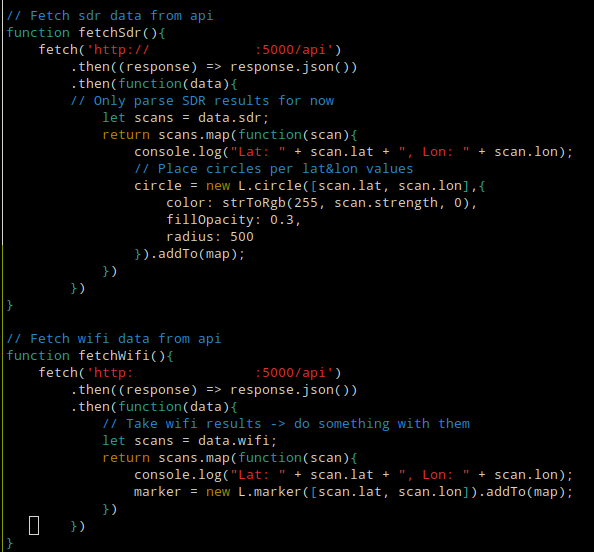
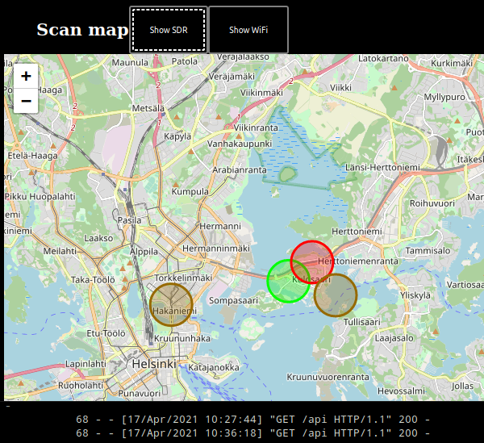

# ICT-Project - Project Icaros

## 17.04 Placing markers on the map with API data

When the device has scanned either SDR frequencies or WiFi signals, and placed itself on the map via GPS coordinates or such the data should be displayed on the map. This is now possible through the **API**. Check out the full report [here.](./Reports/1704_2021_markersfromapi/README.md)

_Fetching the data_

_Data from the API displayed as area markers_

# About

This is the github page of Project Icaros.
This project will be updated as it goes on. 
Project started 20.1.2021 and will end in 14.5.2021.

Project’s idea is to create an Rasperry Pi based SDR gadget that could capture and pinpoint the signal on a web based map. Project’s members are Tommi Muhonen, Nikita Ponomarev, Elmo Rohula ja Aki Ronkainen.
