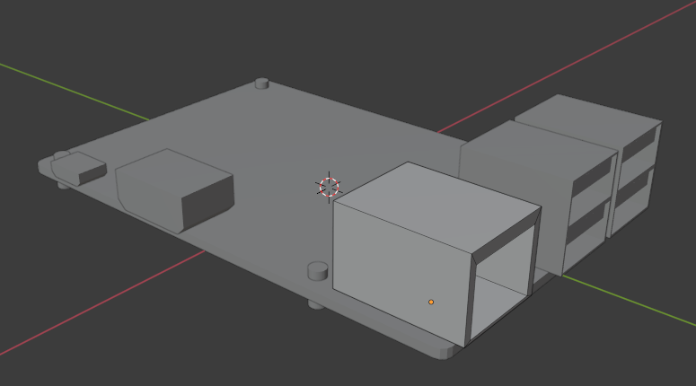
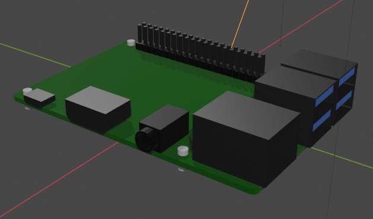
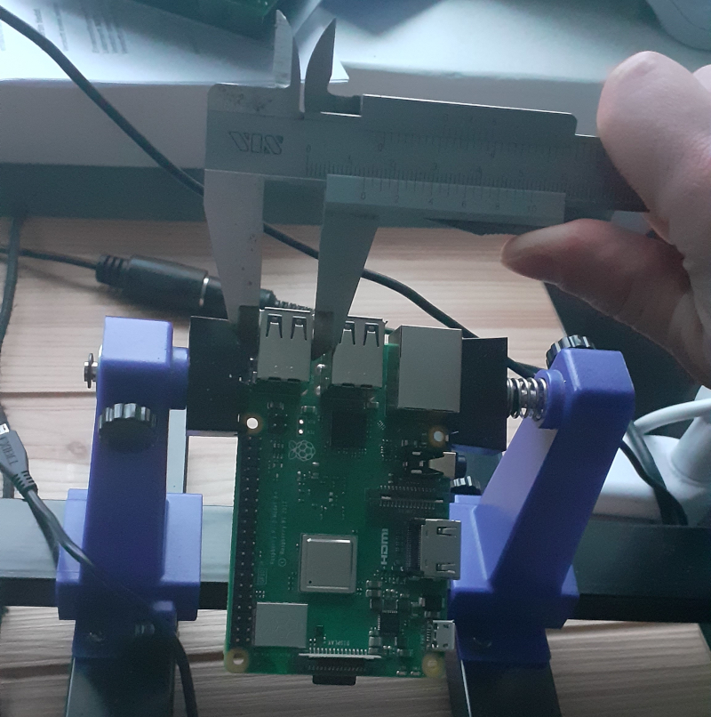
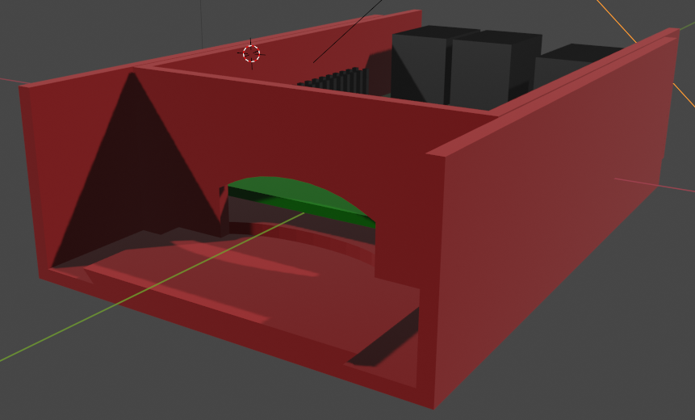
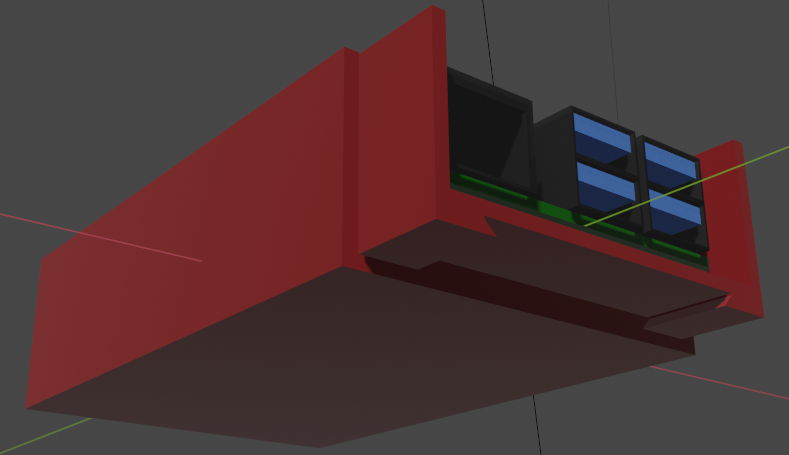
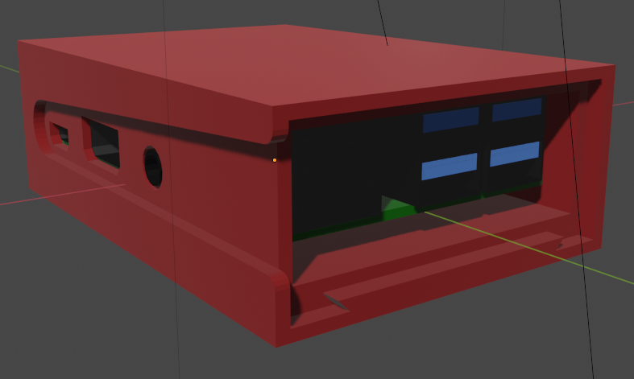

# Creating a case for the Raspberry Pi 3

We needed a case to hold our **Raspberry Pi** if we were to use it on the move. I was familiar with **Blender** the 3D modeling software.

We'd need to secure the **Raspi** to the case by some means, most obvious being with screws, since the **Raspi** comes with 4 mounting holes. I found the mechanical dimensions of the **Pi 3** from [raspberrypi-spy.co.uk.](https://www.raspberrypi-spy.co.uk/2018/03/introducing-raspberry-pi-3-b-plus-computer/)

_Initial model of the **Raspberry Pi**._

I had to make a rough model of the **Raspi** first, so that the case could be designed around the major components.

_Model with all the major components in. Materials added for readability._

_Measuring component dimensions._

After some tinkerin I was able to come up with a "rail system" to attach the top and bottom parts of the case. I haven't yet figured out a locking mechanism, so that the case remains closed. Something like an embedded bearing ball would be cool, but implementing it could be challenging.

_The rails shown from front and back_

_Almost completed case, some details still missing_