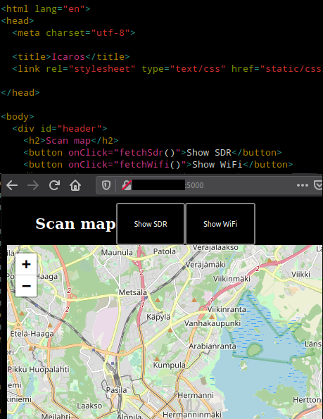

# Markers from API

Since we had a working API which could present us with data from scans, we could easily mark the scans by llocation on the map using the latitude and longitude values of each scan.

_Data from the API_

Easiest way to get the thing going would be to fetch the data from the API, then filter either **SDR**, or **Wifi** results out and iterate over each item.

_Fetch functions for both SDR and WiFi results_

The functions would be called from the **index.html** via two buttons above the map.

_index.html and buttons on the map_

_Area markers fetched by clicking the "Show SDR"-button_

## Running the app

The current version of the map application requires the **psycopg2** Python 3 module to work.

    sudo apt install libpq-dev python3-dev
    pip3 install psycopg2

Replace the **Fetch URL** of **openstreetmap_python/static/js/leaflet.js** with the Raspberry Pi's wg-client IP. This allows the map the be used over the **Wireguard tunnel**. To run the **flask app** through the **Wireguard tunnel** use:

    flask run --host=wg-client_ip // Where wg-client_ip is replaced by the device's wg-client IP address

To run the app locally use:

    flask run

To be able to access the web app through a shared network use:

    flask run --host=0.0.0.0

