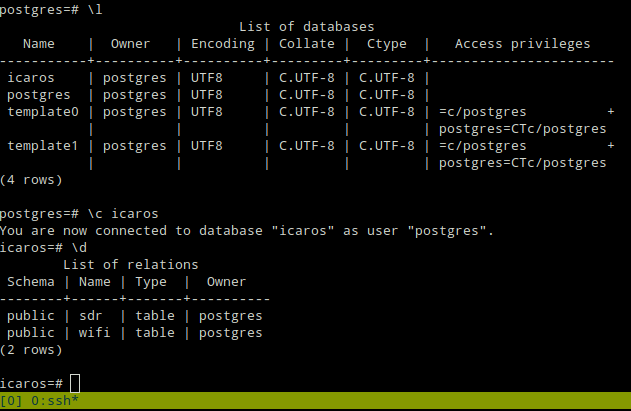

# Creating a database on the Raspberry Pi 3

```
    sudo apt install -y postgresql
    sudo -su postgres

    psql

    CREATE DATABASE icaros;
    CREATE TABLE sdr (scan_id INT PRIMARY KEY, strength int, frequency numeric, lon numeric, lat numeric, modulation varchar(4));
    CREATE TABLE wifi (scan_id INT PRIMARY KEY, SSID varchar(40), BSSID varchar(40), strength int, lon numeric, lat numeric, encryption varchar(80));

    \list // list databases
    \c icaros // connect to DB
    \d // List thingies
```

