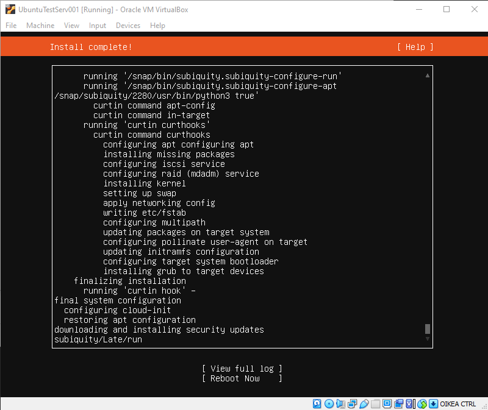
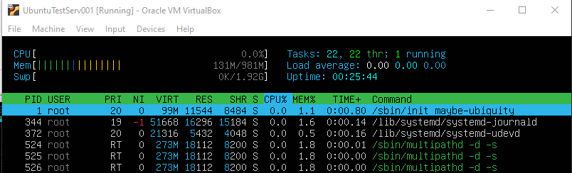
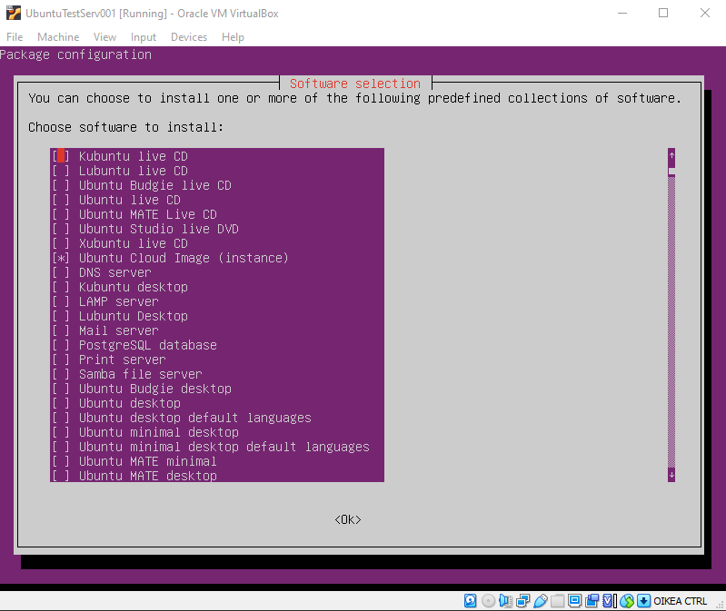
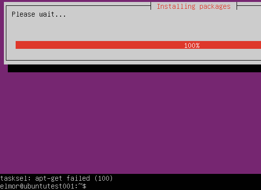
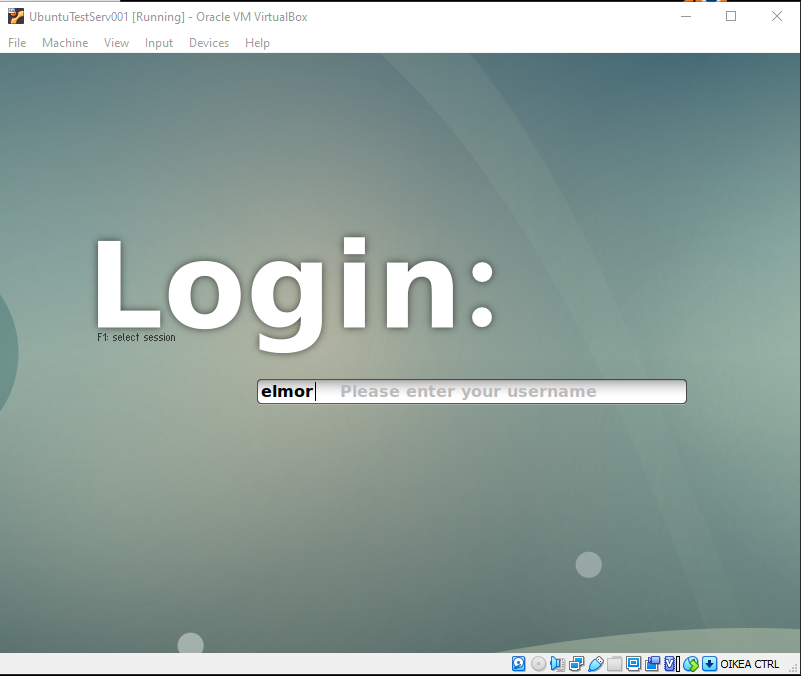
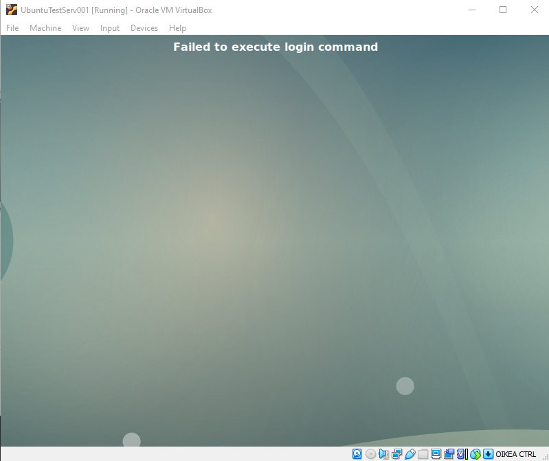
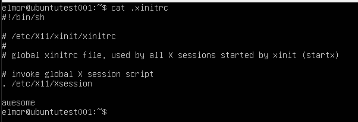
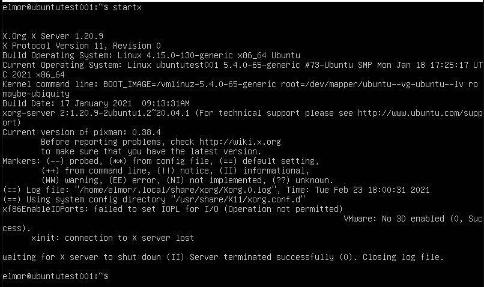
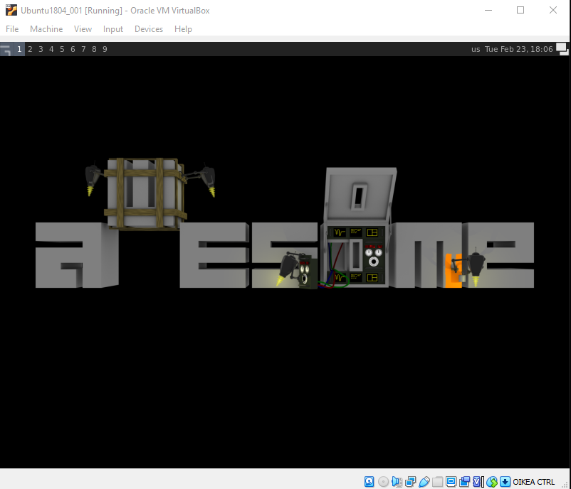
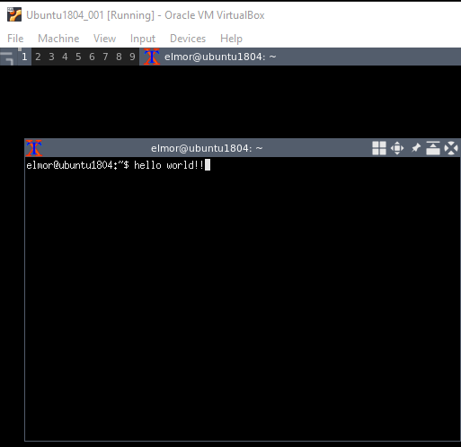

# Installing GUI on a Ubuntu server

After realizing that running **Kismet** on the **Raspberry Pi** with **Linux Kali** proved to be quite difficult, I started looking for alternatives.

Something I had tried previously unrelated to the project was to try and get a **GUI** installed on a clean **Linux Ubuntu server**. Unfortunately, no records of my previous attempts exist, but I remember it taking a long afternoon to get working.

Since running **Kali** isn't a necessity for the project, we could run any distro on the **Rasp**.

Installing a **GUI** on a server distro means there's no extra bulk, only the things we install to it. This could lead to a performance boost.

## Installing Ubuntu server

I started by installing a new virtual machine, with **Linux Ubuntu 20.04 server**.

Machine specs:

  * 1Gb of RAM (to match the **Rasp**)
  * 16Gb HDD (same as above)

The **CPU** performance is hard to evaluate, so I left settings as they were.

Next I created a hidden file called **.hushlogin**. Does nothing fancy, just prevents the MOTD from showing on logon. I also updated the machine.

    $ touch .hushlogin
    $ sudo apt update && sudo apt upgrade -y

After that had finished, I logged in and checked **htop** to see the resource usage on the machine.

    $ htop

As can be seen the server running idle doesn't eat that much of anything. After a big of googling and reading I came across a tutorial at [phoenixnap](https://phoenixnap.com/kb/how-to-install-a-gui-on-ubuntu) for installing a **GUI** on a **Linux** server.

I installed **tasksel**, and opened it to select the **GUI** to be installed.

    $ sudo apt install -y tasksel
    $ sudo tasksel

However after multiple attempts I only got failures.

I then decided to try and install **xfce4** manually.

    $ sudo apt-get install xfce4 slim

I started the service and was greeted by a login screen.

    $ sudo service slim start

I wasn't able to login after multiple attempts, and were stuck in a login screen loop. I got out of it to the regular **tty**-screen by pressing **Right CTRL + F1**.

 
I didn't really know what to do next, the above mentioned article didn't provide much for debugging. After googling for a bit again I found an [article on the archlinux wiki](https://wiki.archlinux.org/index.php/Xinit) about **xinit**. In short, "_**xinit** is a program used to start window managers or desktop environments_" which is exactly what I was trying to achieve.

I had previously used **awesome** window manager with **xinit** so I had little experience with it.

I installed **xinit** and **awesome**, then copied the skeleton of the **xinitrc** configuration file, and configured it.

    $ sudo apt install -y xinit
    $ sudo apt install -y awesome
    $ cp /etc/X11/xinit/xinitrc ~/.xinitrc

_The only addition to the file is the **awesome** at the bottom, which will start the window manager._

I tried starting the window manager using

    $ startx

which would run **xinit**. It wouldn't start after many attempts and reboots.

I had no clue where to look for the cause of the error. I remember having tried **awesome** previously with **Linux Ubuntu 18.04** server so I created a new virtual machine. The specifications would be the same.

I ran the updates on the **18.04** machine and installed **xinit** and **awesome**. **Xinitrc** was also configured the same as above.

I ran the **startx** command again and **awesome** displayed its background!

I didn't have a terminal emulator on it, so I quit the **awesome** and installed **xterm**.

    $ sudo apt install xterm

Now I had a starting point from which to try out using **kismet**.

//// Laita vielä RAM vertailusta (kali v. bubuntu) ja kuvia sekaan

## References

1. [phoenixnap - Installing a GUI on a Linux server](https://phoenixnap.com/kb/how-to-install-a-gui-on-ubuntu)

2. [archwiki - xinit](https://wiki.archlinux.org/index.php/Xinit)