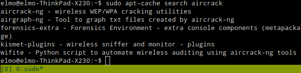
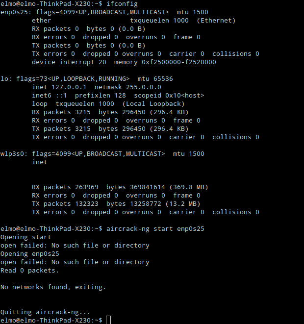

# Raspberry's Kali updates, figuring out Kismet

_After writing this I noticed that I was trying to use **aircrack** to setup my WiFi card as a monitoring one, instead of **airmon**. A report in which I do it correctly can be found [here](../kismet-airmon/README.md)._

The idea was to try out Kali on the Raspberry Pi, and to get familiar with WiFi signal mapping using **Kismet**. I hadn't previously touched **Kismet**, only heard it mentioned by name when it came to WiFi-networks.

One of our project's functionalities would be to heatmap WiFi signals so I started googling with "linux wifi mapping", "wifi mapping", "heatmap wifi" etc. I found a relevant discussion on the subject and started digging. [Discussion in question.](https://mangolassi.it/topic/17139/wifi-heatmapping-on-linux/7)

In the discussion was [a link to a list](https://alternativeto.net/software/inssider/?platform=linux#) containing alternative applications for something called **inSSIDer**. I hadn't heard of **inSSIDer** before, but I noticed that something called **Kismet** had the following info written: _"Kismet is an 802.11 layer2 wireless network detector, sniffer, and intrusion detection system."_

I decided to install said software to my laptop running Linux Ubuntu.

    $ sudo apt update && sudo apt install -y kismet

According to [Cyber Weapons Lab's](https://null-byte.wonderhowto.com/how-to/use-kismet-watch-wi-fi-user-activity-through-walls-0182214/) instructions on using the software I'd need a **NIC** with the ability to put it in promiscuous mode. You could achieve it with the use of **airmon-nf/aircrack-ng**. The program can be found from **apt**. I installed said program.

    $ sudo apt-cache search aircrack
    $ sudo apt install -y aircrack-ng

Next I tried to see if I could set my NIC to promiscuous mode with the few commands I looked up from [airmon-ng's documentation.](https://www.aircrack-ng.org/doku.php?id=airmon-ng)

    $ ifconfig 
    $ aircrack-ng start enp0s25

Nothing useful came out of it. I either had wrong parameters or didn't undestand the program's functionality. I think the former is correct since the error message reads _"Opening start -- open failed:[....]"_. It seems weird to me that the program would try to "open" start. I decided to take a small break and return to this at another point in time. **Kismet** wouldn't (presumably at least) work without a NIC in promiscuous mode, so this'd be something I'd have to figure out.

During this time of reading and testing **aircrack** the Raspberry Pi had been updating itself. At some point the screen went black for a good 25 minutes. After coming back from the break I was greeted by the **Kali** login screen. I logged in and the updates had been installed succesfully!

