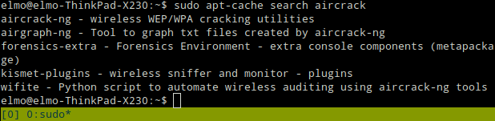

// OLD FINNISH WRITE-UP
// SEE README.MD IN THIS FOLDER
// FOR CURRENT, ENGLISH ONE
//
//

# Raspberryn Kalin päivitystä, Kismetin kokeilua

Ajatuksena tässä oli lähteä kokeilemaan Kalin yleistä toimintaa Raspberry Pi:llä, sekä alustavasti kokeilla **Kismetiä** WiFi signaalien kartoitukseen. En ollut aikaisemmin tutustunut **Kismetiin** muuten kuin kuullut sen nimen mainittavan puhuttaessa WiFi-verkoista.

Projektimme yksi toiminnalisuus olisi jonkin näköinen eri signaalien heatmäppäys kartalle ja rupesin etsimään Googlesta hakusanoilla "Linux wifi mapping", "wifi mapping", "heatmap wifi" jne. jne. Löysin erään keskustelun, jossa kyselijä halusi tietää pystyykö Linuxilla juurikin WiFi-signaalien heatmäppäykseen. [Linkki keskusteluun.](https://mangolassi.it/topic/17139/wifi-heatmapping-on-linux/7).

Keskustelusta löytyi [linkki listaukseen](https://alternativeto.net/software/inssider/?platform=linux#), jossa tarjottiin vaihtoehtoja "inSSIDer"ille. En tiennyt mikä inSSIDer oli, mutta sivua yleisesti selailessa huomasin kohdan **Kismet**, jonka alla luki "Kismet is an 802.11 layer2 wireless network detector, sniffer, and intrusion detection system."

Päätin asentaa ohjelmiston läppärilleni tarkastelua varten. Läppärilläni pyörii Linux Ubuntu.

    $ sudo apt update && sudo apt install -y kismet

[Cyber Weapons Labin ohjeen](https://null-byte.wonderhowto.com/how-to/use-kismet-watch-wi-fi-user-activity-through-walls-0182214/) mukaan koneen verkkokortti tulisi laittaa myös kuuntelevaan tilaan. Tämä onnistuisi **airmon-ng/aircrack-ng:llä**. Ohjelma löytyy suoraan **aptista** hakemalla. Asensin tämän jälkeen kyseisen ohjelman

    $ sudo apt-cache search aircrack
    $ sudo apt install -y aircrack-ng

Seuraavaksi kokeilin parilla komennolla saisinko verkkokorttini kuuntelevaan tilaan ilman sen kummempia kikkailuja.
Komentoihin apua löysin [airmon-ng:n dokumentaatiosta.](https://www.aircrack-ng.org/doku.php?id=airmon-ng)

    $ ifconfig 
    $ aircrack-ng start enp0s25

Mitään hyösyllistä ei tullut tuosta lopputulokseksi. Ajattelin siirtyä pidettyäni pienen tauon pöytäkoneelleni pähkäilemään asiaa Kali-virtuaalikoneen äärelle. **Kismetin** tulisi vaatimaan verkkokortin, joka on kuuntelutilassa, joten tämä täytyi selvittää ennen kuin **Kismetillä** pääsisi kokeilemaan mitään järkevää.

Koko tämän ajan Raspberry Pi oli pyörinyt taustalla päivittäin siihen asennettua Kalia. Jossain vaiheessa ruutu oli mennyt pimeäksi. Ajattelin liittyvän päivityksiin, sillä valot vilkkuivat vielä. Tässä vaiheessa Raspberry Pi oli päivittänyt itseään n. 2 tuntia. (tähän kuvia)