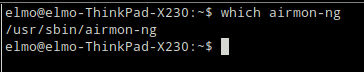
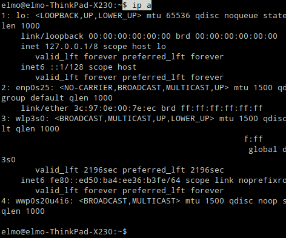
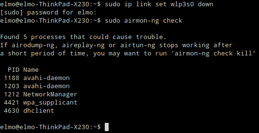
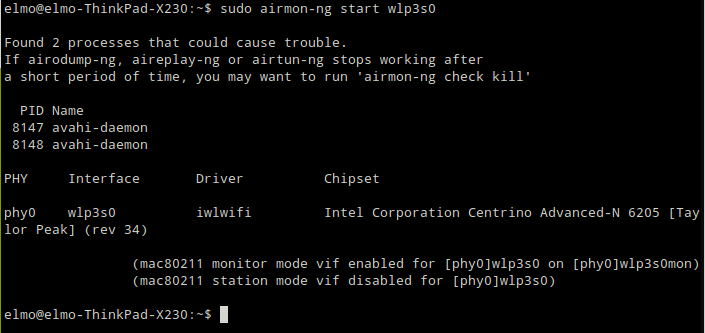
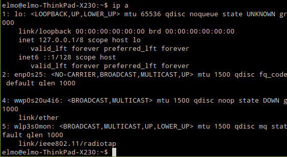
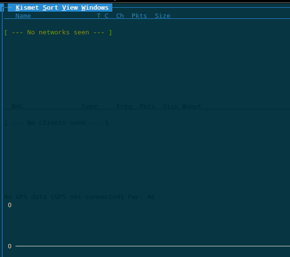
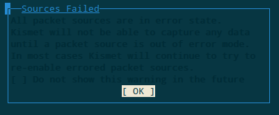
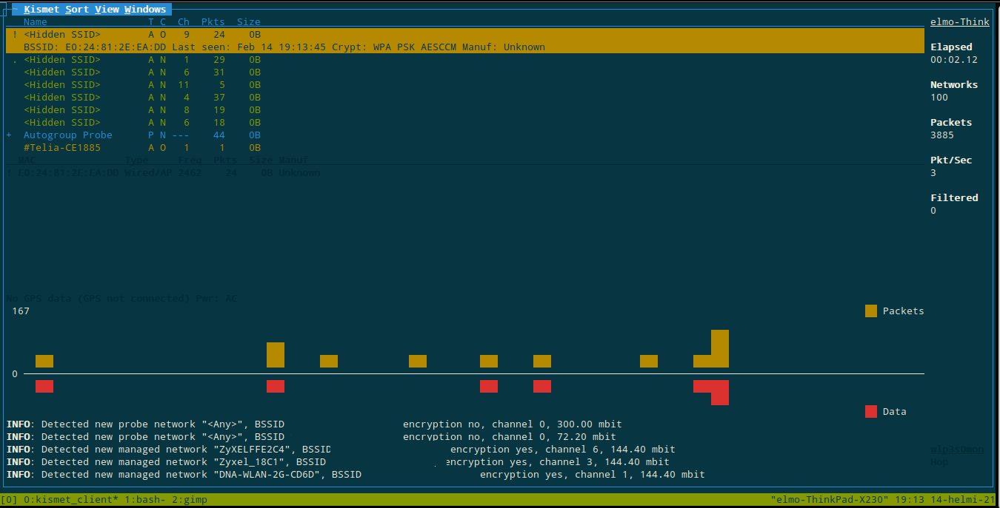

# Figuring out Kismet, success with airmon-ng

_A bit of a warning upfront. The commands used here can in some scenarios mess with your system. Be careful when trying them out. Read the **man**-pages._

As I figured out later, **aircrack-ng** "is an 802.11 WEP and WPA/WPA2-PSK key cracking program." (**aircrack-ng** man pages). I had wasted some time and effort, but luckily not much. Lessons learned: always at least check the **man**-pages of programs you are following tutorials on, instead of blindly assuming things.

The program that is used to get WiFi cards working in monitoring mode is called **airmon-ng**, which gets installed as you install **aircrack-ng**. I would betrying this out on my laptop, which is running **Linux Ubuntu**, before trying to mess with things on the Raspberry Pi. I had no prior knowledge whether or not my WiFi card was compatible, but the amount of work to get it running didn't seem like much.

I would be using [Pablo Gallardo's blog post](https://diarium.usal.es/pmgallardo/2020/12/28/how-to-set-your-wireless-adapter-to-monitor-mode-in-linux/) as a guide for setting things up.

First I checked if I had **airmon-ng** installed

    $ which airmon-ng

The I checked all my available network adapters

    $ ip a

Most wireless adapters name themselves "wlan0, wlan1, etc." in the rare cases I've had to check on network adapters. I had previously messed with my laptop so I knew my wireless adapter was the **wlp3s0**.

Next the blog post says to stop the process **NetworkManager**. Reading down a few points it's stated that in order to get the WiFi card set to monitoring mode, all possibly interfering processes must be stopped/killed. I read from the **airmon-ng's** man-page, that you can use the command

    $ airmon-ng check

to list possibly interfering programs.

Next I deactivated my wireless adapter. I also used **airmon-ng** to kill all possibly interfering processes.

    $ sudo ip link set wlp3s0 down
    $ sudo airmon-ng check kill
    $ sudo systemctl stop NetworkManager

I also started **airmon-ng** on the now deactivated wireless adapter and checked if anything had been going on with the wireless adapter.

    $ sudo airmon-ng start wlp3s0
    $ ip a

As can be seen, the adapter was now called **wlp3s0mon**, indicating that the adapter was in monitoring mode. Next I fired up **kismet** to see if I could catch anything interesting.

    $ sudo kismet -c wl3ps0mon

Kismet didn't return any usable results and also gave an error message.

Going through the tutorial and my command history, I noticed I hadn't re-enabled my wireless adapter after switching it to monitoring mode. I re-enabled the adapter and fired up **kismet** again.

    $ sudo ip link set wlp3s0mon up
    $ sudo kismet -c wl3ps0mon

No luck, I got the identical error message. After double and triple checking everything - card i monitoring mode, brought back up, no interfering processes - I decided to look for a tutorial. I found a simple-ish tutorial from [Cyber Weapons Lab](https://null-byte.wonderhowto.com/how-to/use-kismet-watch-wi-fi-user-activity-through-walls-0182214/) and saw they used the

    $ kismet -c YourCardName

command without sudo. I decided to try it too. And it started working!

Now I had the program running. Next in the "to-do"-pipeline would be to set **kismet** up on the Raspberry Pi.