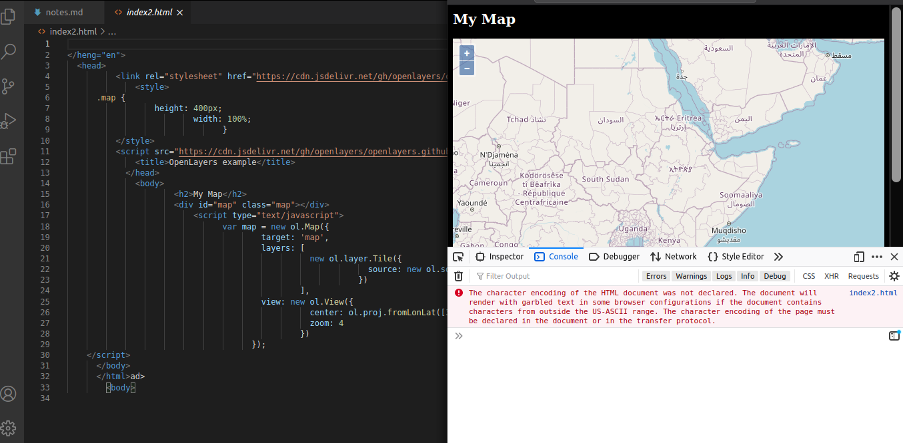
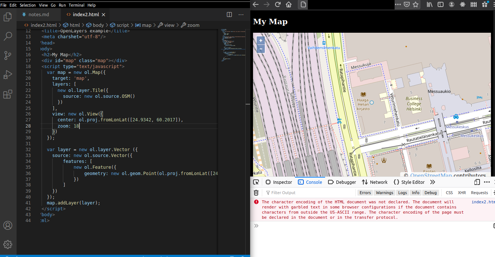

# Testing the map with an internet browser

Our project would require us to use a map to place the signals or sources of signals somewhere. I decided to try and find out if there was a way to display a map on a simple HTML-page.

For instructions, I used Tero Karvinen's [ "Getting Started with OpenLayers and OpenStreetMap".](http://terokarvinen.com/2012/getting-started-with-openlayers-and-openstreetmap/)

First I tried simply copying the code and applying it to an HTML-file. However, while trying, the console reported an error ".transform is not a function".

Next I tried looking for obvious mistakes/typos from the code, but couldn't find any. While browsing through [OpenLayers' documentation](https://openlayers.org/en/latest/apidoc/), I noticed a lot of differences. Some of the functions seemed similiar but there were no matches.

So I searched the **OpenLayers** for a simple tutorial in case they had updated things along the years. I found one such tutorial with great explanations of the different parts of the code. [Link to said tutorial](https://openlayers.org/en/latest/doc/quickstart.html). I simply copied the code and refreshed my browser. It worked!

While copying the code to **Vim** it turned into a pile of spaghetti, so I decided to save myself the trouble (for now) and move to **VSCode**.

To make sure that the successful first try with the map wasn't a fluke I replaced the coordinates in the code with the coordinates of Haaga-Helia's campus in Pasila. I also changed the zoom level to 16 so we could see some details.

The map displayed the right place!

I looked around the internet to see if I could make a marker on the map to specific coordinates. For heatmapping, or mapping signals in general, this would be a must-have feature. The tutorial in question I found from [Openstreetmap's website](https://openstreetmap.be/en/projects/howto/openlayers.html).

I copied the code under section 6. I refreshed the page and a round marker appeared on top of Haaga-Helia!

The marker is quite faint, but in the future this would be updated. You can try the map out for youself! Just download the index2.html [here.](./index2.html)
