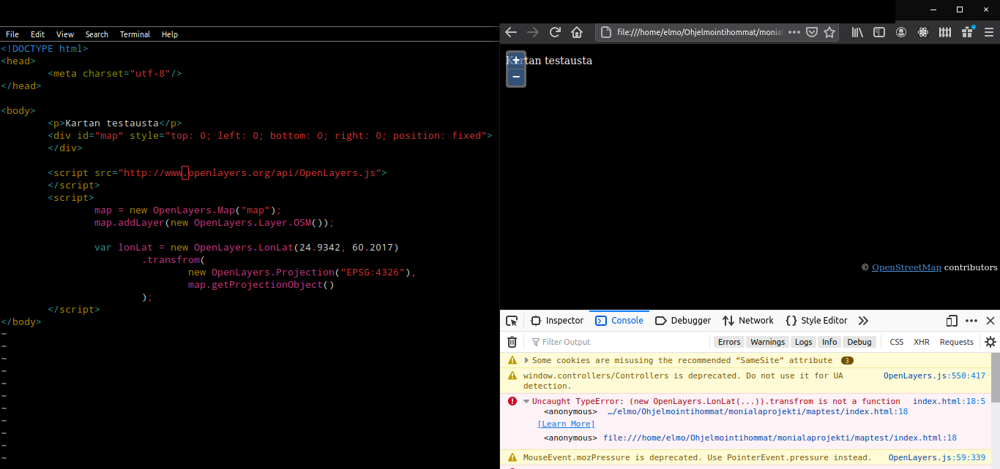
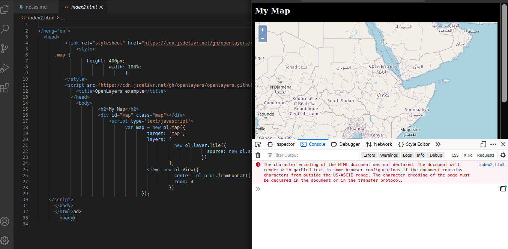
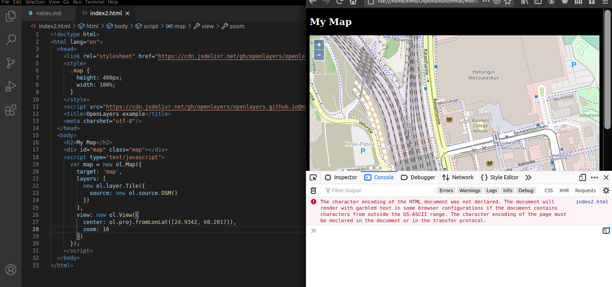
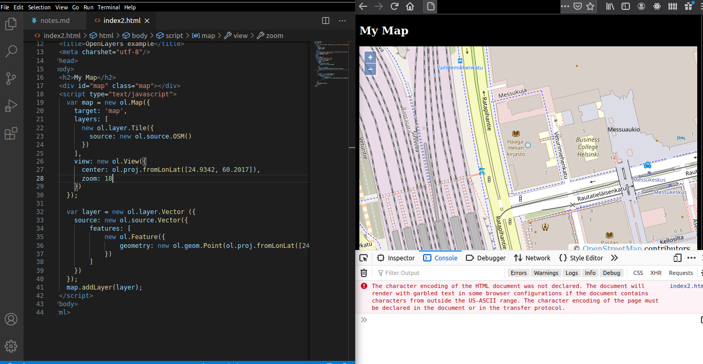

// OLD WRITE-UP IN FINNISH!
// SEE [README.MD](./README.md) FOR
// THE CURRENT, ENGLISH ONE
//
//
//
//

# Kartan testausta internet-selaimella

Tulisimme tarvitsemaan projektissamme karttaa, joten päätin lähteä selvittämään kuinka helposti saisi esimerkiksi perus-HTML-sivulle näytettyä kartan.

Ohjeena käytetty Tero Karvisen ohjetta "Getting Started with OpenLayers and OpenStreetMap" (linkkaa!!!)

Aluksi testaukseen kopioitiin koodi sanasta sanaan Teron sivuilta. Testauksen yhteydessä kuitenkin tuli virhe vastaan, joka ilmoitti, että ".transform is not a function"

Seuraavaksi tarkastin koodini virheiltä. Ehkä minulta oli jäänyt jotain huomaamatta, mutta en vain saanut sivua toimimaan.

Katsoin läpi myös [OpenLayersin dokumentaatiota](https://openlayers.org/en/latest/apidoc/), mutta en löytänyt etsimiäni kohtia. Yritin katsoa löytyisikö LonLatista, Projectionista tai getProjectionObject():sta mitään. Kaikki liippasivat läheltä, mutta eivät vaikuttaneet olevan samoja komponentteja.

Etsin OpenLayersistä jotakin simppeliä, yhden sivun ohjetta, jolla saisi kartan näkyviin. Sellainen löytyi! [Linkki ohjeeseen.](https://openlayers.org/en/latest/doc/quickstart.html)
Kopion löytyvän koodipätkän ja sain kartan näkyviin! Jippii!

Kopiomani koodi jostain syystä muuttui spagetiksi liitettyäni sen Vimillä tiedostoon. Homma kuitenkin pelitti.

Jotta olisin varma, että tämä ei ollut vain bittien järjestäytymistä oikein täyden sattuman takia, päätin vaihtaa koodissa olevat koordinaatit, sekä zoomauksen tason. Laiton Haaga-Helian Pasilan kampuksen koordinaatit, sekä zoomaus-tason 16, jotta näkisimme muutakin, kuin Pasilan yleisesti.

Kartta näytti oikeaan paikkaan ja vieläpä tarkemmin kuin aikaisemmassa testauksessa!

Katsaisin saisinko myös nopeasti lisättyä jonkun merkin, täplän taikka markkerin haluamilleni koordinaateille karttaan. Löysin nopeasti googlaamalla ohjeen, jossa oltiin tehty juuri miettimäni. [Linkki ohjeeseen.](https://openstreetmap.be/en/projects/howto/openlayers.html)

Kopion sivulta koodin kohdan 6 alta. Päivitin sivun ja Haaga-Helian päälle ilmestyi pyöreähkö merkki!

Kuvassa merkki näkyy heikosti, mutta tulevaisuudessa tulisimme päivittämään merkit näkyvämmiksi.