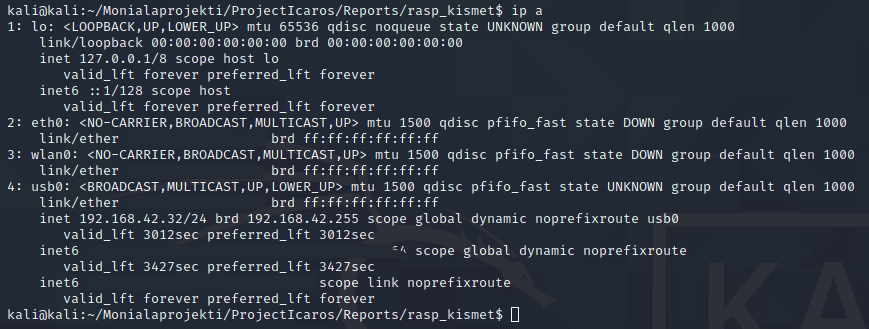

# Trying out Kismet on Raspberry Pi

Now that I had tried out **airmon-ng** and **kismet** on my laptop it'd be time to bring things over to the **Raspberry Pi**. The model I have is the **3B+**, which has an integrated WiFi adapter. There were no guarantees that the WiFi adapter could be brought up to monitoring mode, but we would find that out during the course of this little excersice.

First I started by updating the Raspberry Pi

	$ sudo apt update
	$ sudo apt upgrade -y

It took about 20 minutes. I've noticed that the time it takes to update **Raspbery Pi** is quite long even with relatively small updates.

Now I would begin the same process as before, with my laptop. I checked if the device already had **airmon-ng** and **kismet** installed. I would assume so, since the **Raspberry Pi** is running **Linux Kali**.

	$ which airmon-ng
	$ which kismet

Then I checked the available network adapters.

	$ ip a

I checked any possibly interfering processes with **airmon-ng**, killed those processes, and checked again if I had any interfering processes running. Then I set **wlan0** to monitoring mode, checked to see if it was up (**wlan0mon**), and ran **kismet**.

	$ sudo airmon-ng check
	$ sudo airmon-ng check kill
	$ sudo airmon-ng check

	$ sudo airmon-ng start wlan0
	$ ip a
	$ kismet -c wlan0mon

After that **kismet** ran succesfully! It was picking up WiFi signals and printing them in the terminal. On top of the terminal, it redirected me to **localhost:2501** to use the **web-UI** of **kismet**.

I opened **Firefox** and headed to said address. At this point the **Raspberry Pi** began to choke. I wasn't able to do anything on the machine, the screen updated every 5 seconds. I managed to snap one screenshot. The UI said it wasn't able to connect to the **kismet**-server, yet in the background it tried to welcome me to use the UI.

After trying out everything for 40 minutes I decided to pull the plug (literally). I suspect the **Raspberry Pi's** limited RAM of 1Gb was the cause of the extreme slowdown. I would have to figure out how to run **kismet** with the terminal UI.

On my laptop **kismet** automatically used the terminal UI. Then again, I installed it through **apt** on my laptop whereas on the **Raspberry Pi** it came pre-installed with the **Linux Kali.**
