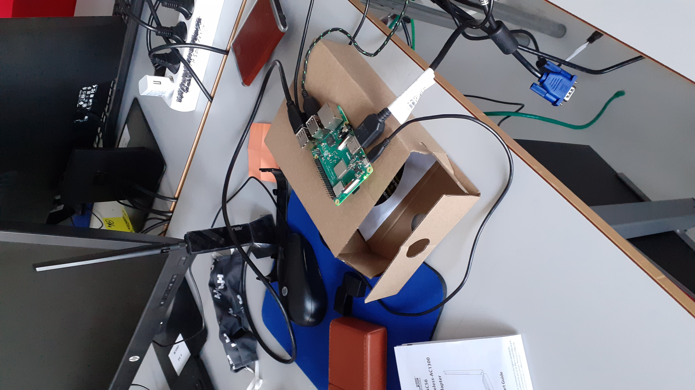

# Configuring WiFi antenna and spotting networks

During our meet on thursday we were enable to configure an external **WiFi**-antenna, get it connected to a network and spot available **access-points**. We were also able to connect to the **Raspberry Pi** via our server which we had set up as a **VPN**. In the future, once the **Raspberry Pi** gets powered on, it automatically connects to the server so that any of us could connect to it remotely.

We had previously found out that the integrated **WiFi** adapter of the **Raspberry Pi 3** was capable of monitoring **WiFi** signals, but we weren't sure if it was - in theory - capable of injecting into **WiFi** traffic.

**Nikita** had bought an **ASUS USB-AC56** WiFi-adapter, so we had to get it running on the **Raspberry Pi 3**.

Since we had no means to insert the included driver CD which came with the adapter, we somehow had to install the drivers for it from another source. Somebody had already created a thread on [askubuntu](https://askubuntu.com/questions/404881/how-do-i-install-an-asus-usb-ac56-wifi-adapter) about it so we follow in their steps.

However following the steps, the installation for some reason wasn't successful and we weren't able to connect to a **WiFi** network.

    git clone https://github.com/abperiasamy/rtl8812AU_8821AU_linux.git
    sudo make -f Makefile.dkms install
    sudo modprobe rtl8812au

Following [another thread on askubuntu](https://askubuntu.com/questions/1254923/install-uninstall-asus-usb-ac56-on-ubuntu-20-04) we were able to get the adapter working. The commands were quite similiar but the later installation seemed to do the trick.

After this, we configured the **Raspberry Pi** for remote use through our **VPN server**. We used a USB-powerbank to power the **Raspberry Pi** as **Nikita** walked around the school premises while we checked if the connection was stable. We were also able to print out names of **WiFi** access-points near the **Raspberry Pi**.

## References

https://askubuntu.com/questions/404881/how-do-i-install-an-asus-usb-ac56-wifi-adapter

https://askubuntu.com/questions/1254923/install-uninstall-asus-usb-ac56-on-ubuntu-20-04

https://askubuntu.com/questions/567006/how-can-i-display-the-list-of-available-wifi-networks

https://nullr0ute.com/2016/09/connect-to-a-wireless-network-using-command-line-nmcli/