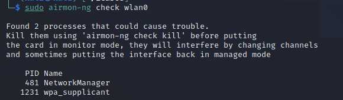

# Introduction
In order to capture information on WiFi hotspots, we acquired an ASUS USB-AC56 due to it being [mentioned as working with Kali Linux 2020](https://miloserdov.org/?p=2196) (which I presumed would mean with aircrack-ng too.
After our [initial tests](https://github.com/Nikitushka/ProjectIcaros/tree/main/Reports/raspi_wifi) with WiFi - the question was: is ASUS USB-AC56 capable of monitor mode and packet injection?

The short answer is a guaranteed yes, for a longer answer please keep on reading.

# Prerequisites
Interesting enough, on my Oracle VirtualBox image of Kali Linux (2020.4) came with pre-installed RTL8812AU drivers. I only found this out after trying to install the drivers [as mentioned in our previous WiFi report](https://github.com/Nikitushka/ProjectIcaros/tree/main/Reports/raspi_wifi), but in order to successfully install the drivers, I had to update my linux headers and linux image with:
```
sudo apt update -y
sudo apt-cache search linux-headers
sudo apt-cache search linux-image
``` 
after finding the most recent amd64 image and header, I installed them with:

```
sudo apt-get install linux-headers-$(whatever the recent version will be)
sudo apt-get install linux-image-$(whatever the recent version will be)

# and rebooted with
sudo reboot
```
alternatively this can be done with

```
sudo apt update -y
sudo apt dist-upgrade -y
sudo reboot
```
Now when ASUS USB-AC56 is plugged it can be viewed with
```
lsusb
```


# ASUS USB-AC56

Now that the drivers fine, we can check whether the interface is up with `ifconfig` and `iwconfig`:


After seeing the wlan0 interface being up (in my case, since I have no other wifi interface on this pc than the one provided by the network card), I proceeded in a typical Kali Linux hacking manner as described for example [by coady.tech](https://coady.tech/hacking-wi-fi-with-kali-linux/)

I ran `sudo airmon-ng` and saw my device in the output:


Then, I ran `sudo airmon-ng check wlan0` to check if any interfering processes need to be killed and followed the instructions provided by airmon-ng:



And the first confirmation of monitoring mode being supported was when I ran `sudo airmon-ng start wlan0` after killing the potential interfering processes:


*Kaching!* It is on!

### Note: if the next step doesn't work, make sure to reboot and replub the usb device.

Finally, I ran `sudo airodump-ng wlan0` and got a list of nearby WiFi networks. I was able to capture handhsakes from my network when a device connected to it and to send deauth packets in order to force devices to disconnect, confirming that injection works. After capturing the handshake I was able to "crack" it, by using my actual WiFi password as a list and the handshake in a .cap file, like described in the [coady.tech article](https://coady.tech/hacking-wi-fi-with-kali-linux/)

# Conclusion
Project Icaros can wholeheartedly guarantee that ASUS USB-AC56 work with AT LEAST `Linux kali 5.10.0-kali4-amd64 #1 SMP Debian 5.10.19-1kali1 (2021-03-03) x86_64 GNU/Linux` and most probably later versions - and supports both monitor mode and packet injection. 

# References 

[Our Initial Wifi Report - https://github.com/Nikitushka/ProjectIcaros/tree/main/Reports/raspi_wifi](https://github.com/Nikitushka/ProjectIcaros/tree/main/Reports/raspi_wifi)
[Hacking Wi-Fi with Kali Linux - https://coady.tech/hacking-wi-fi-with-kali-linux/](https://coady.tech/hacking-wi-fi-with-kali-linux/)
[How To Install ALFA AWUS1900 Kali Linux 2018.4 - https://online-it.nu/how-to-install-alfa-awus1900-kali-linux-2018-4/](https://online-it.nu/how-to-install-alfa-awus1900-kali-linux-2018-4/)
[Can't install Linux Headers (Kali Linux) - StackExchange - https://unix.stackexchange.com/questions/328655/cant-install-linux-headers-kali-linux](https://unix.stackexchange.com/questions/328655/cant-install-linux-headers-kali-linux)
